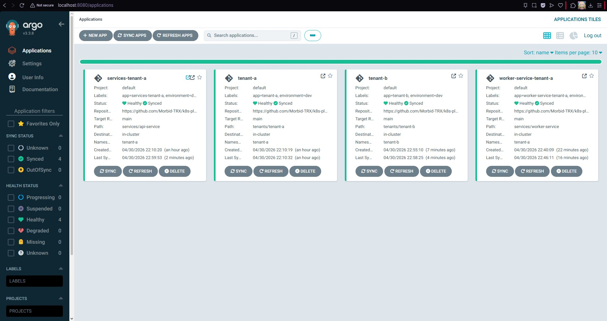
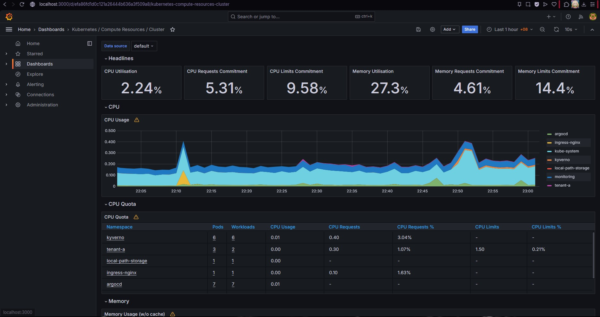
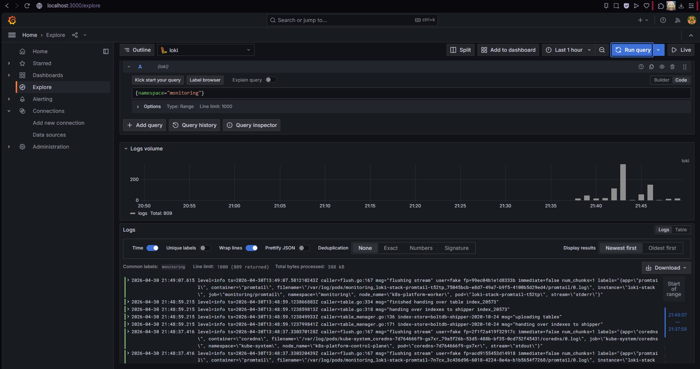
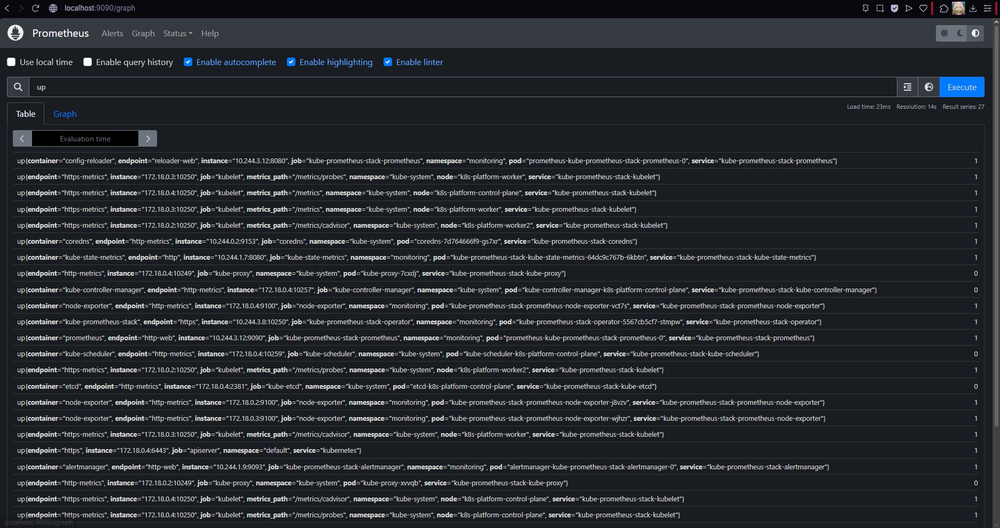
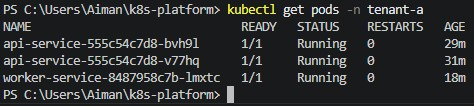
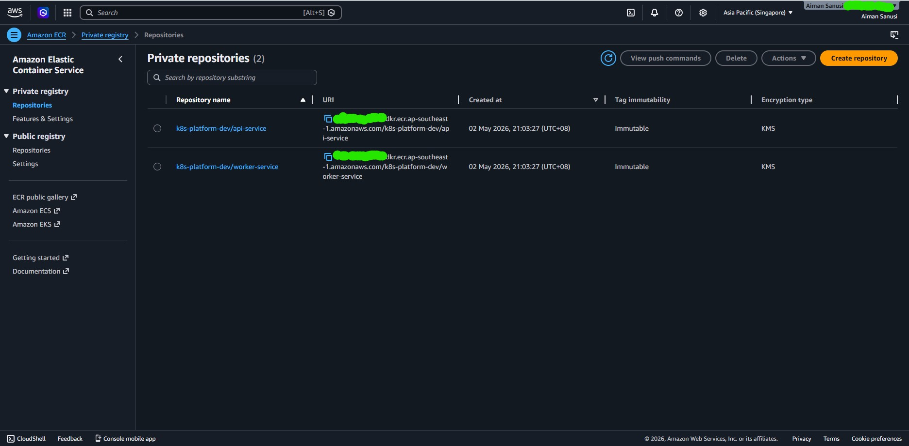
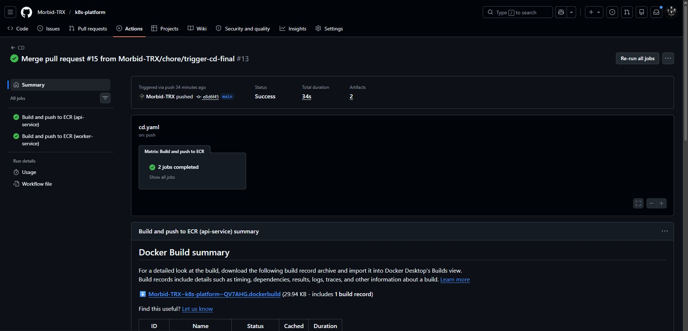

# k8s-platform

A production-grade, multi-tenant Kubernetes platform demonstrating real DevOps/SRE skills.
Built with GitOps, observability, security policies, and automated CI/CD to AWS ECR.

> Companion project to [terraform-lab](https://github.com/Morbid-TRX/terraform-lab) — together they tell a complete cloud infrastructure story.

## Architecture
Internet (Route 53 + ACM TLS)
│
▼
NGINX Ingress Controller
(TLS termination · rate limiting)
│
┌────┴──────────────┐
▼                   ▼
Tenant A            Tenant B
namespace           namespace
(NetworkPolicy + RBAC + ResourceQuota)
│
▼
Platform (shared services)
├── ArgoCD       — GitOps continuous delivery
├── Prometheus   — metrics scraping
├── Grafana      — dashboards and alerting
├── Loki         — log aggregation
└── Kyverno      — security policy enforcement

## Screenshots

### ArgoCD — GitOps apps synced from GitHub


### Grafana — Kubernetes cluster overview


### Grafana — Loki log aggregation


### Grafana — Prometheus targets


### kubectl — services running in tenant-a


### AWS ECR — Docker images pushed via OIDC


### GitHub Actions — CD pipeline green


## Stack

| Layer | Tools |
|-------|-------|
| Runtime (local) | kind |
| Runtime (cloud) | AWS EKS (planned) |
| GitOps | ArgoCD |
| Metrics | Prometheus + Grafana |
| Logs | Loki + Promtail |
| Security | Kyverno |
| CI/CD | GitHub Actions |
| Infrastructure | Terraform (ECR, IAM, S3, DynamoDB) |
| Package manager | Helm |
| Image registry | AWS ECR (KMS encrypted, immutable tags) |
| Auth | GitHub OIDC — no static AWS credentials |

## Project Structure
k8s-platform/
├── infrastructure/        # Terraform: ECR, IAM OIDC, S3 state backend
│   ├── environments/
│   │   └── dev/           # Dev environment — ECR + GitHub OIDC role
│   └── modules/
│       ├── ecr/           # ECR repositories with lifecycle policies
│       ├── eks/           # EKS cluster (planned)
│       ├── vpc/           # VPC + subnets
│       └── github-oidc/   # GitHub Actions OIDC provider + IAM role
├── platform/              # Helm values + ArgoCD apps
│   ├── argocd/
│   ├── prometheus-stack/
│   ├── loki-stack/
│   ├── kyverno/
│   └── ingress-nginx/
├── tenants/               # Per-tenant namespace configs
│   ├── _template/         # Copy this to add a new tenant
│   ├── tenant-a/
│   └── tenant-b/
├── services/              # Microservices
│   ├── api-service/       # FastAPI + Prometheus metrics
│   └── worker-service/    # Background processor
└── .github/workflows/     # CI/CD pipelines
├── ci.yaml            # Pre-commit, lint, helm lint
└── cd.yaml            # Build + push to ECR via OIDC

## AWS Infrastructure

Provisioned with Terraform, state stored in S3 with DynamoDB locking.

| Resource | Details |
|----------|---------|
| ECR repositories | `k8s-platform-dev/api-service`, `k8s-platform-dev/worker-service` |
| ECR settings | KMS encrypted, immutable tags, scan on push, lifecycle policies |
| GitHub OIDC provider | `token.actions.githubusercontent.com` |
| IAM role | `k8s-platform-dev-github-actions` — assumed by GitHub Actions only |
| IAM policy | ECR push scoped to this cluster's repos only |
| S3 state bucket | `k8s-platform-tfstate-582165930795` — encrypted, versioned |
| DynamoDB lock table | `k8s-platform-tflock` |

## CD Pipeline

Triggers on push to `main` when files in `services/` change.
git push → GitHub Actions → OIDC authenticates to AWS (no static keys)
→ ECR login → Docker build → push to ECR

| Step | Tool | Details |
|------|------|---------|
| OIDC auth | aws-actions/configure-aws-credentials | Assumes IAM role via short-lived token |
| ECR login | aws-actions/amazon-ecr-login | Authenticates Docker to ECR |
| Build | docker/build-push-action | Buildx with GHA cache |
| Push | ECR | Immutable versioned tags (e.g. `v20260502-abc1234`) |

## Local Setup

### Prerequisites

| Tool | Version | Install |
|------|---------|---------|
| Docker Desktop | Latest | [docker.com](https://docker.com) |
| kubectl | v1.34+ | `winget install Kubernetes.kubectl` |
| kind | v0.31+ | `winget install Kubernetes.kind` |
| helm | v4.1+ | `winget install Helm.Helm` |
| k9s | v0.50+ | `winget install derailed.k9s` |

### 1. Create the cluster

```bash
kind create cluster --name k8s-platform --config kind-config.yaml
```

### 2. Install NGINX ingress

```bash
kubectl apply -f https://raw.githubusercontent.com/kubernetes/ingress-nginx/main/deploy/static/provider/kind/deploy.yaml
kubectl wait --namespace ingress-nginx --for=condition=ready pod \
  --selector=app.kubernetes.io/component=controller --timeout=90s
```

### 3. Install ArgoCD

```bash
kubectl create namespace argocd
kubectl apply -n argocd -f https://raw.githubusercontent.com/argoproj/argo-cd/stable/manifests/install.yaml
kubectl wait --namespace argocd --for=condition=ready pod \
  --selector=app.kubernetes.io/name=argocd-server --timeout=120s
```

### 4. Get ArgoCD password

```bash
kubectl -n argocd get secret argocd-initial-admin-secret \
  -o jsonpath="{.data.password}" | base64 -d
```

### 5. Install observability stack

```bash
helm repo add prometheus-community https://prometheus-community.github.io/helm-charts
helm repo add grafana https://grafana.github.io/helm-charts
helm repo update

helm install kube-prometheus-stack prometheus-community/kube-prometheus-stack \
  --namespace monitoring --create-namespace \
  --values platform/prometheus-stack/values.yaml \
  --version 57.1.1

helm install loki-stack grafana/loki-stack \
  --namespace monitoring \
  --values platform/loki-stack/values.yaml \
  --version 2.10.2 \
  --set loki.image.tag=2.9.3 \
  --set promtail.config.clients[0].url=http://loki-stack:3100/loki/api/v1/push
```

### 6. Install Kyverno

```bash
helm repo add kyverno https://kyverno.github.io/kyverno
helm install kyverno kyverno/kyverno \
  --namespace kyverno --create-namespace \
  --values platform/kyverno/values.yaml \
  --version 3.1.4

kubectl apply -f platform/kyverno/policies.yaml
```

### 7. Deploy tenants and services via ArgoCD

```bash
kubectl apply -f platform/argocd/apps/
```

### 8. Build and load service images

```bash
docker build -t k8s-platform/api-service:v1.0.0 services/api-service/
docker build -t k8s-platform/worker-service:v1.0.0 services/worker-service/
kind load docker-image k8s-platform/api-service:v1.0.0 --name k8s-platform
kind load docker-image k8s-platform/worker-service:v1.0.0 --name k8s-platform
```

### Access the UIs

| Service | Command | URL |
|---------|---------|-----|
| ArgoCD | `kubectl port-forward svc/argocd-server -n argocd 8080:443` | https://localhost:8080 |
| Grafana | `kubectl port-forward svc/kube-prometheus-stack-grafana -n monitoring 3000:80` | http://localhost:3000 |
| Prometheus | `kubectl port-forward svc/prometheus-operated -n monitoring 9090:9090` | http://localhost:9090 |

## Security

| Control | Implementation |
|---------|---------------|
| No root containers | Kyverno ClusterPolicy |
| No latest image tags | Kyverno ClusterPolicy |
| Required pod labels | Kyverno ClusterPolicy |
| Resource limits required | Kyverno ClusterPolicy |
| Cross-tenant isolation | NetworkPolicy (default deny) |
| RBAC | Per-namespace Role + RoleBinding |
| No static AWS credentials | GitHub OIDC — short-lived tokens only |
| ECR image scanning | Scan on push enabled |
| ECR encryption | KMS encrypted repositories |
| Immutable image tags | Cannot overwrite existing tags |

## Cost Estimate (AWS EKS — when provisioned)

| Resource | Cost |
|----------|------|
| EKS control plane | $72/mo |
| 2x t3.medium nodes | ~$73/mo |
| ECR + Route 53 + ALB | ~$25/mo |
| **Total** | **~$170/mo** |

> Current AWS spend: ~$0/mo (ECR free tier, S3/DynamoDB minimal cost)

## Status

| Phase | Status |
|-------|--------|
| Project scaffold | ✅ Done |
| Local cluster (kind) | ✅ Done |
| NGINX ingress | ✅ Done |
| ArgoCD GitOps | ✅ Done |
| Prometheus + Grafana | ✅ Done |
| Loki log aggregation | ✅ Done |
| Kyverno security policies | ✅ Done |
| Multi-tenant namespaces | ✅ Done |
| Microservices deployed | ✅ Done |
| AWS ECR repositories | ✅ Done |
| GitHub OIDC + IAM role | ✅ Done |
| CD pipeline → ECR | ✅ Done |
| Terraform remote state (S3) | ✅ Done |
| AWS EKS deployment | 🔜 Planned |
| Full GitOps loop (ArgoCD → EKS) | 🔜 Planned |

## Author

[Morbid-TRX](https://github.com/Morbid-TRX)
